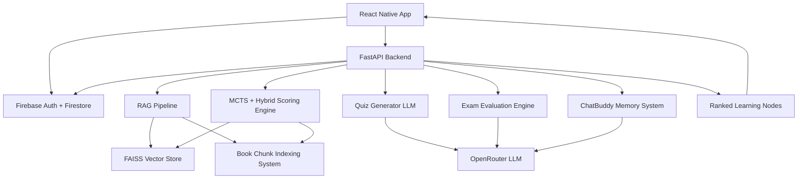
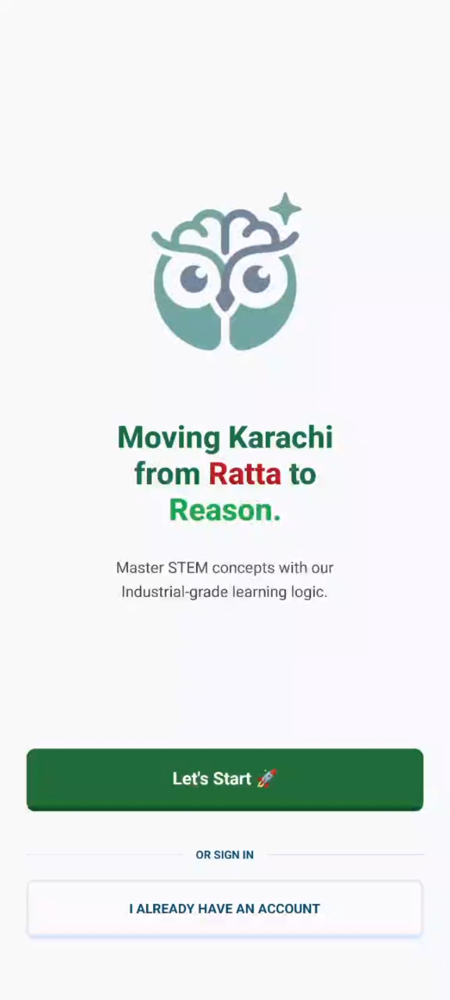
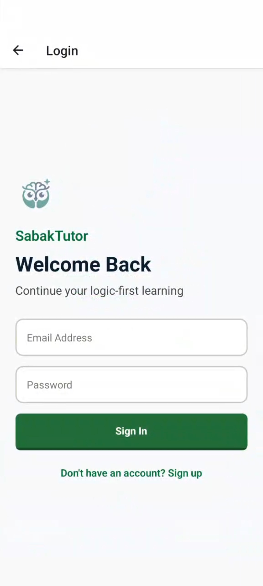
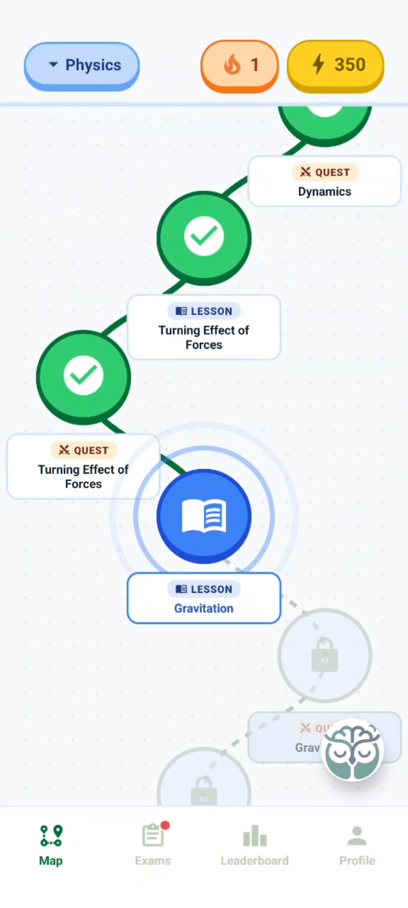
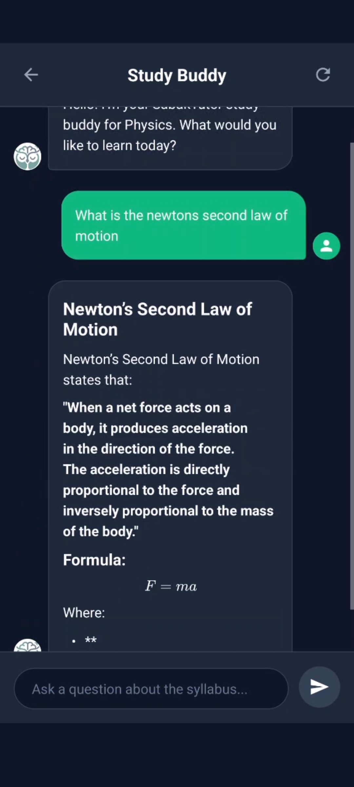
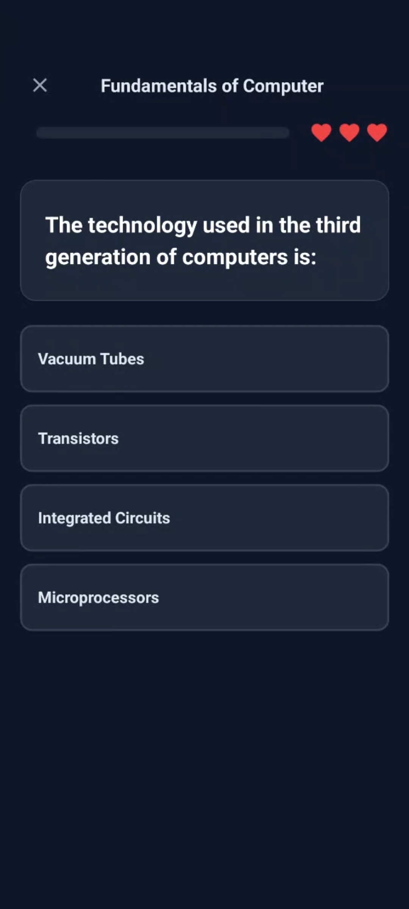
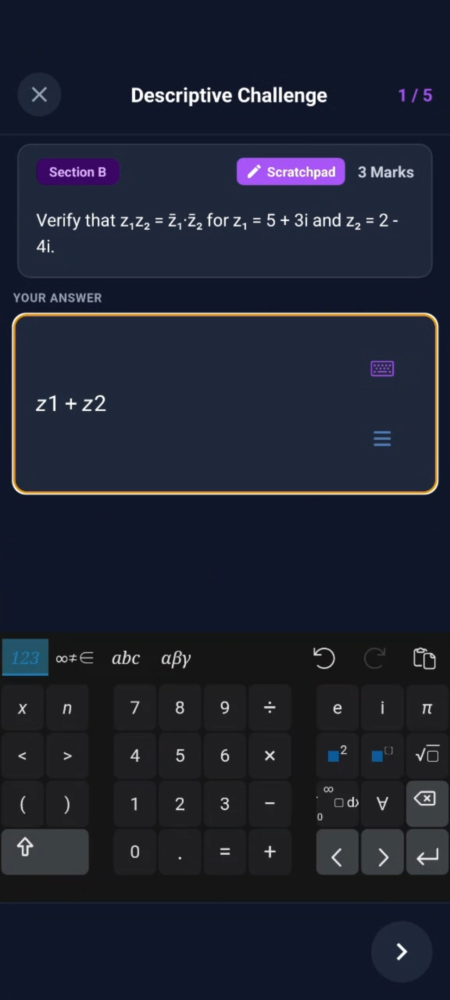
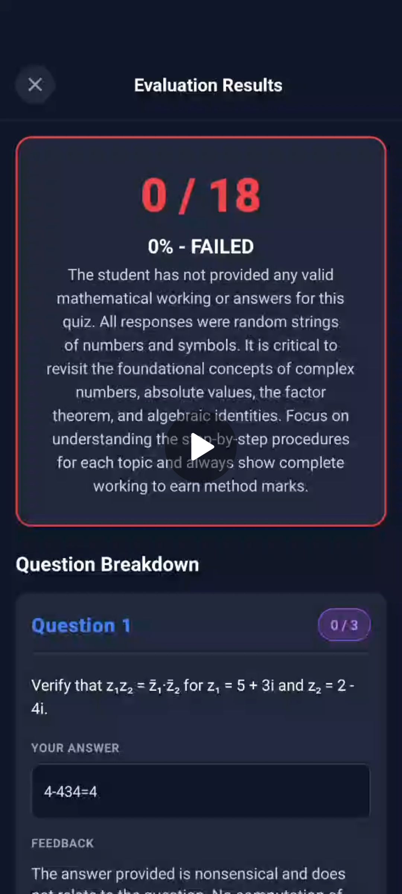
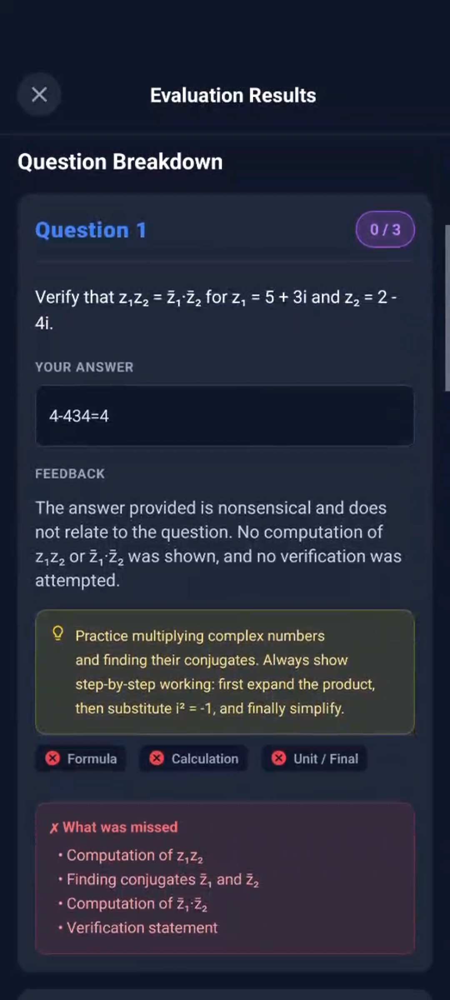
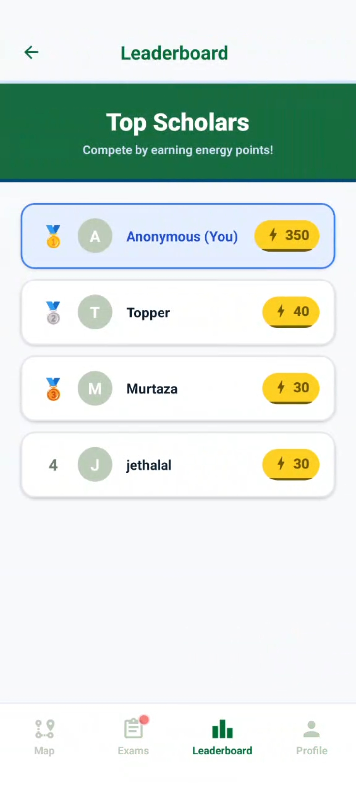

# 📚 SabakTutor MVP

<p align="center">
  
</p>

<p align="center">
  <b>AI-Powered Adaptive Learning Platform with RAG, MCTS-Inspired Intelligence & Gamified Education</b>
</p>

<p align="center">
  
  
  
  
  
</p>

---

## 🚀 Overview

SabakTutor is an AI-driven adaptive learning system that converts structured curriculum into a **fully personalized, dynamic, and continuously evolving learning experience**.

It combines:

- 🧠 LLM-based tutoring (ChatBuddy)
- 📚 Retrieval-Augmented Generation (RAG)
- 🧩 FAISS-based vector storage for curriculum chunks
- 🗺️ Node-based learning progression system
- 🧪 Dynamic quiz + exam generation
- 🌲 MCTS-inspired adaptive learning path optimization
- 🏆 Gamification (XP, streaks, leaderboard)

---

## 🧠 System Architecture



---

## 🔐 Authentication & Onboarding

* Firebase Authentication (Login / Signup)
* Class selection (Grade 9)
* Subject selection:

  * 📘 Mathematics
  * 💻 Computer Science
  * 🔬 Physics

---

## 💬 ChatBuddy (AI Tutor)

* RAG-based responses using FAISS-retrieved book chunks
* Karachi curriculum contextual adaptation
* Short-term memory (last 5 messages)
* Long-term summarized memory
* Fast conversational inference pipeline

---

## 🗺️ Learning Map (Node-Based Progression System)

* Each node = lesson + flashcards + quiz
* Sequential unlocking (Node N → Node N+1)
* Firestore-synced progress tracking
* Adaptive progression based on performance

---

## 📚 FAISS-Based Retrieval System

FAISS is used as the **core vector database for storing and retrieving curriculum chunks**.

### Responsibilities:

* Stores embedded book chunks
* Enables semantic search over curriculum
* Feeds context into:

  * ChatBuddy
  * Quiz generation
  * Exam evaluation

```text
Retrieval Score = cosine_similarity(query_embedding, chunk_embedding)
```

---

## 📖 Flashcards System

* Definitions
* Formulas
* Key concepts
* Pre-quiz reinforcement layer

---

## 🧪 Adaptive Quiz Engine

* LLM-generated questions using FAISS context
* 10 questions per chapter:

  * MCQs (major weight)
  * Fill in the blanks
  * True/False

### Rules:

* 3 ❤️ lives per quiz
* Difficulty-balanced generation
* Context-aware question creation

---

## 🧾 Exam Mode (Advanced Evaluation System)

### Mathematics / Computer Science:

* 4 short questions
* 1 long question

### Physics:

* 2 theory
* 2 numericals
* 1 long question

### Features:

* Scratchpad for rough work
* Math-special keyboard
* LLM-based step-by-step evaluation
* Weak-area detection + feedback

---

## 🏆 Leaderboard & Gamification

* Global ranking system
* XP-based progression
* Daily streak tracking
* Competitive learning dynamics

---

## ⚙️ Backend Intelligence Layer

### 🧠 FAISS Retrieval Layer

```text
Retrieval Score = similarity(query_embedding, chunk_embedding)
```

---

### 🧠 Value Prediction Model

```text
Value(Node) = LLM_mastery_gain + historical_success_rate
```

---

### 🌲 MCTS-Inspired Scoring

```text
Score(Node) =
Q(Node) +
C × sqrt(ln(N) / n(Node)) +
V(Node)
```

---

### 🔗 Final Fusion Score

```text
Final Score =
  α × FAISS_Score +
  β × Value_Prediction +
  γ × MCTS_Score
```

---

## 🔄 Learning Flow

1. Login / Signup
2. Select Class & Subject
3. Enter Learning Map
4. Unlock Node
5. Study Lesson + Flashcards
6. Attempt Quiz
7. Unlock Next Node
8. Take Exam Mode
9. Earn XP + Leaderboard Rank

---

## 🧱 Tech Stack

| Layer     | Technology               |
| --------- | ------------------------ |
| Frontend  | React Native (Expo)      |
| Backend   | FastAPI (Python)         |
| Vector DB | FAISS                    |
| Database  | Firebase Firestore       |
| LLM       | OpenRouter               |
| Retrieval | Hybrid RAG               |
| Streaming | Server-Sent Events (SSE) |

---

# 📸 UI / UX Showcase

---

## 🔐 Login & Signup Flow

<p align="center">
  
  
</p>

---

## 🗺️ Learning Map (Node Progression System)

<p align="center">
  
</p>

---

## 💬 ChatBuddy Interface

<p align="center">
  
</p>

---

## 🧪 Quiz Interface

<p align="center">
  
</p>

---

## 🧾 Exam Mode

<p align="center">
  
</p>

---

## 🧾 Exam Evaluation Breakdown

<p align="center">
  
  
</p>

---

## 🏆 Leaderboard

<p align="center">
  
</p>

---

## 🔥 Daily Streak

<p align="center">
  
</p>

---
## ⚔️ Comparison With Existing Platforms

| Feature             | Duolingo       | Khan Academy | SabakTutor                         |
| ------------------- | -------------- | ------------ | ---------------------------------- |
| Content             | Static lessons | Video-based  | 🧠 AI-generated dynamic content    |
| Personalization     | Rule-based     | Limited      | Fully adaptive AI system           |
| Question Generation | Fixed          | Fixed        | 🔥 Real-time LLM + FAISS           |
| Memory System       | ❌              | ❌            | 💬 ChatBuddy memory (short + long) |
| Learning Path       | Linear         | Semi-linear  | 🌲 MCTS-based adaptive graph       |
| Evaluation          | Basic scoring  | MCQ-based    | 🧠 LLM step-by-step grading        |
| Exam System         | ❌              | Partial      | 🧾 Full AI exam engine             |
| Intelligence Layer  | None           | None         | ⚙️ FAISS + Value + MCTS fusion     |

---

## 🧠 Key Innovation

SabakTutor is not a traditional LMS.

It is:

> A self-adaptive AI learning system combining retrieval-augmented generation, vector search (FAISS), and reinforcement-inspired decision-making.

---

## 🚀 Why This Project Stands Out

* Real FAISS-based retrieval system
* Dynamic AI quiz + exam generation
* Memory-aware conversational tutor
* Adaptive learning path optimization
* Multi-signal ranking engine (FAISS + Value + MCTS)
* Full production-grade backend architecture

---

## 📜 License

MIT License

---

## ⭐ Future Improvements

* Voice-enabled ChatBuddy
* OCR-based math input solver
* Multiplayer quiz battles
* Teacher analytics dashboard
* Parent progress tracking system
